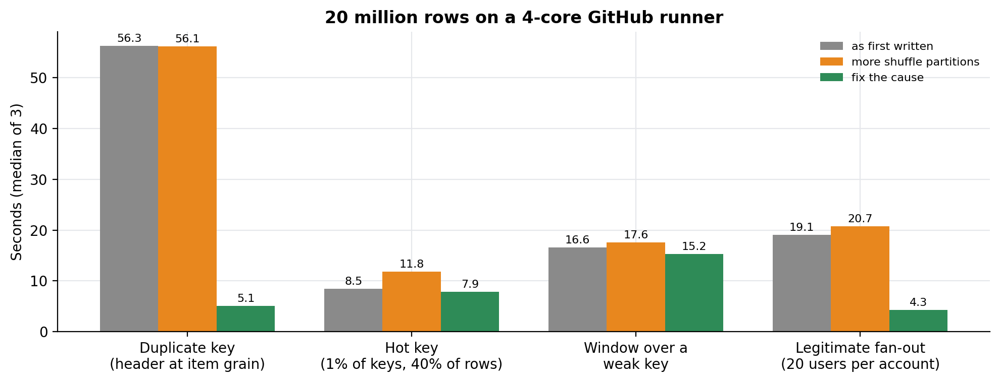
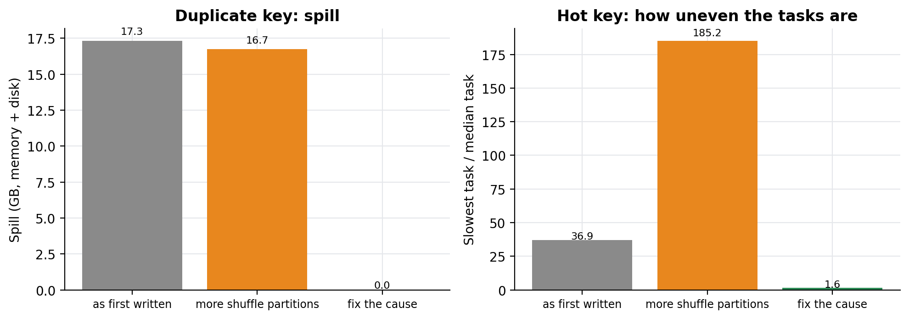

# PySpark fan-out and skew lab

Four join problems that make Spark jobs slow in production lakehouses, rebuilt on synthetic data, each run three ways: as first written, with the fix people usually try first (more shuffle partitions), and with the fix that addresses the cause. The benchmark runs in GitHub Actions, so anyone can rerun it from the Actions tab.

Companion code for the article **[How to fix slow PySpark joins](https://lucas.rangeltech.net/articles/g1-fix-slow-pyspark-joins/)**.

## The four scenarios

| Scenario | Shape | The fix that addresses the cause |
|---|---|---|
| `duplicate_key` | a header table built at item grain repeats each key about 12 times, so the join multiplies rows | prove the kept columns are constant per key, deduplicate before the join, broadcast the result |
| `hot_key` | 1% of the keys carry 40% of the rows, against a table too large to broadcast | adaptive query execution's skew join |
| `weak_window_key` | `row_number()` over a key where 20% of rows share an empty value | give rows without a key their own key; keep the other groups unchanged |
| `legitimate_fanout` | every account really has 20 users; joining transactions to users repeats each one 20 times | aggregate each side to the key before joining |

All data is generated by `lab/scenarios.py` with fixed seeds. Every fix is checked against the naive query with a row count and an order-independent checksum (sum of `xxhash64` over all columns); only the window scenario is expected to differ, because there the naive key is the bug.

## Results

20 million rows, standard GitHub runner (4 vCPU, 16 GB), median of three runs. Run [37086764815](https://github.com/LucasRangelSSouza/pyspark-fanout-skew-lab/actions/runs/37086764815), stored in `results/run-37086764815/`.

| Scenario | As first written | More shuffle partitions | Fix the cause |
|---|---:|---:|---:|
| Duplicate key | 56.3 s, 17 GB spill | 56.1 s, 17 GB spill | 5.1 s, no spill |
| Hot key (slowest task / median task) | 8.5 s (36.9) | 11.8 s (185.2) | 7.9 s (1.6) |
| Window over a weak key | 16.6 s | 17.6 s | 15.2 s |
| Legitimate fan-out | 19.1 s | 20.7 s | 4.3 s |





The full table, with shuffle read, spill and task skew for every variant, is in `results/run-37086764815/summary.md`.

## How it measures

Each variant runs in its own Spark application with the event log enabled and writes its result to Spark's `noop` sink, so the timing covers the whole query without any storage cost. Task metrics (shuffle read, spill, slowest and median task time) are read from the event log afterwards.

## Run it

Python 3.11 and Java 17.

```bash
pip install -r requirements.txt
python -m lab.bench generate --rows 2000000 --data /tmp/lab-data
python -m lab.bench run --scenario duplicate_key --variant right --data /tmp/lab-data --out results.jsonl
python -m lab.summary results.jsonl
python -m lab.figures results/run-37086764815/results.jsonl figures
```

Or run the whole benchmark in GitHub Actions: **Actions → Benchmark → Run workflow**, with the number of rows as input. The results come back as the `results` artifact.

## Files

| File | What it is |
|---|---|
| `lab/scenarios.py` | data generator and the four scenarios, three variants each |
| `lab/bench.py` | runs one variant, reads task metrics from the event log, computes the checksum |
| `lab/summary.py` | Markdown table of medians, and whether each fix matches the naive result |
| `lab/figures.py` | the figures above |
| `.github/workflows/bench.yml` | the benchmark in GitHub Actions, three repeats |
| `results/` | the run used in the article |

## License

Apache 2.0. See [LICENSE](LICENSE).
